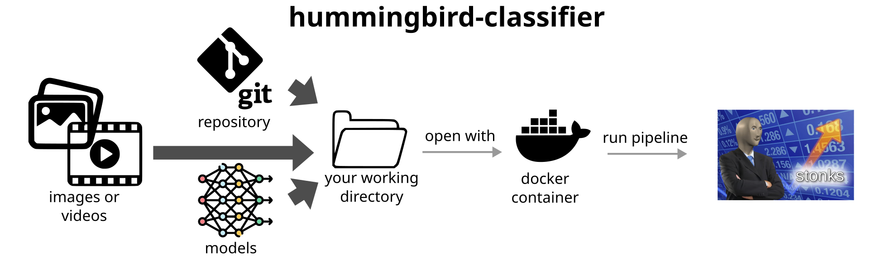

[](https://hummingbird-classifier.readthedocs.io/en/latest/?badge=latest)


# What is hummingbird-classifier? 
`hummingbird-classifier` is a Deep Learning image processing pipeline for detecting hummingbirds visiting a focal plant. 

## What can it be used for? 
`hummingbird-classifier` can sort images likely to contain a hummingbird from images without hummingbirds. It *cannot* localise (i.e. draw a box around) the object of interest, and it will most likely *not work* for any other visitor but hummingbirds. 

## Who can use it? 
Anyone!

<!-- ------------------------------------------- -->

# Get started
<!-- LINKS -->
The documentation is being finished, [ReadTheDocs](https://hummingbird-classifier.readthedocs.io/en/latest/) link coming soon.


Overview of hummingbird-classifier v1.0

## Quickstart

0. You need to install: 
    - Docker Engine: https://www.docker.com/get-started/
    - git: https://git-scm.com/book/en/v2/Getting-Started-Installing-Git
1. Clone repo:
``` bash
git clone --single-branch --branch master https://gitlab.renkulab.io/biodetect/hummingbird-classifier
cd hummingbird-classifier
```
2. Download models and unpack in `hummingird-classifier/models`: [Linkie coming soon](https://gitlab.renkulab.io/biodetect/hummingbird-classifier)
3. Pull and run the Docker image, binding current folder as volume; run the below commands **one by one**: 

    Linux / MacOS
    ``` bash
    commit_sha=$(git rev-parse --short=7 origin/HEAD)
    docker run --rm -ti -v ${PWD}:/work/hummingbird-classifier --workdir /work/hummingbird-classifier -p 8888:8888 registry.renkulab.io/biodetect/hummingbird-classifier:${commit_sha} jupyter lab --ip=0.0.0.0
    ```
    Windows
    ``` batch
    for /f %i in ('git.exe rev-parse HEAD') do set commit_sha=%i
    set commit_sha=%commit_sha:~0,7%
    docker run --rm -ti -v %cd%:/work/hummingbird-classifier --workdir /work/hummingbird-classifier -p 8888:8888 registry.renkulab.io/biodetect/hummingbird-classifier:%commit_sha% jupyter lab --ip=0.0.0.0
    ```
4. Run the command: 
    - The first time, it will take a long time because it has to download the image (~10 GB); successive runs will be much faster.
    - Once the Docker container is running, your terminal should display something like:
    ``` 
    To access the server, open this file in a browser:
        file:///home/jovyan/.local/share/jupyter/runtime/jpserver-14-open.html
    Or copy and paste one of these URLs:
        http://a62c488a6f4c:8888/lab?token=2fb162adc7251f04e37cb8d6f1f55db2fbdbc7d2e1d9e1e8
        http://127.0.0.1:8888/lab?token=2fb162adc7251f04e37cb8d6f1f55db2fbdbc7d2e1d9e1e8
    ```
    - Copy-paste the **third** URL displayed in your terminal in a web browser (i.e. Firefox, Chrome) and you should see the Jupyterlab interface. 

5. Once in the Jupyerlab interface, you can run the inference script: 
    - On the left-hand pane, you can navigate the files like a normal folder; double-clicking them will open them.
    - Open `workflows/run_pipeline.sh`
    - Modify the first few lines so they look like this (don't forget to save them if you modify them!): 
    ``` bash
    ROOT_DIR="/work/hummingbird-classifier"
    MODEL="mobilenet-v0"
    VIDEO_PATH="${ROOT_DIR}/demo"
    ANNOTATIONS="${ROOT_DIR}/data/Weinstein2018MEE_ground_truth.csv"
    ```
    - In a new tab, click "Terminal".
    - Type in, **one by one** these commands:
        ```
        cd workflows
        run_pipeline.sh
        ```
    - Wait for the model to run, then inspect results in `results`.

-------------------------

## Documentation

*...coming soon...*

Direct links to docs sections: 

1. Installation 

2. Workflow and Models

3. Examples

4. Processing scripts

-------------------------------------------

## Contributions
<!-- AUTHORS -->
- Luca Pegoraro (WSL) - luca.pegoraro@wsl.ch
- Michele Volpi (SDSC) - michele.volpi@sdsc.ethz.ch

<!-- CONTACTS -->

<!-- FEATURE REQUESTS?  -->

<!-- ### How to cite
LEAVE BLANK FOR PREPRINT OR PAPER
------------------------------------------- -->

## Changelog 

**v0.0.0** Never did we track versions before for this... 

## ToDo list

*TBD*